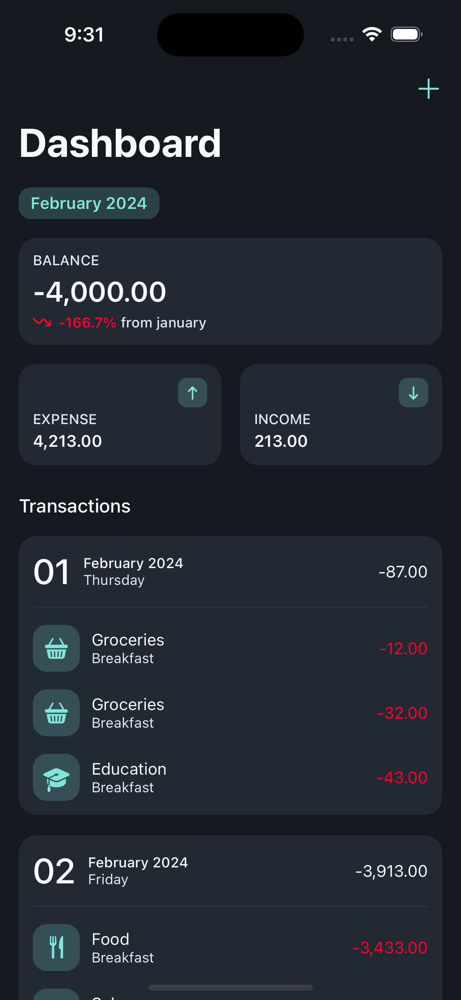

## Run Project
1. Go to the project directory
2. Generate xcodegen and open xcodeproj file with:
    ```shell
    ./setup.sh
    ```
    
## Build With
* UIKit Programmatically
* Clean Architecture with MVVM
* RxSwift
* CoreData
* MonthYearWheelPicker (https://github.com/bendodson/MonthYearWheelPicker)

## Demo
| Dashboard | Add | Detail |
| :---------: | :---------: | :---------: |
|  |  |  |
|  |  |  |
